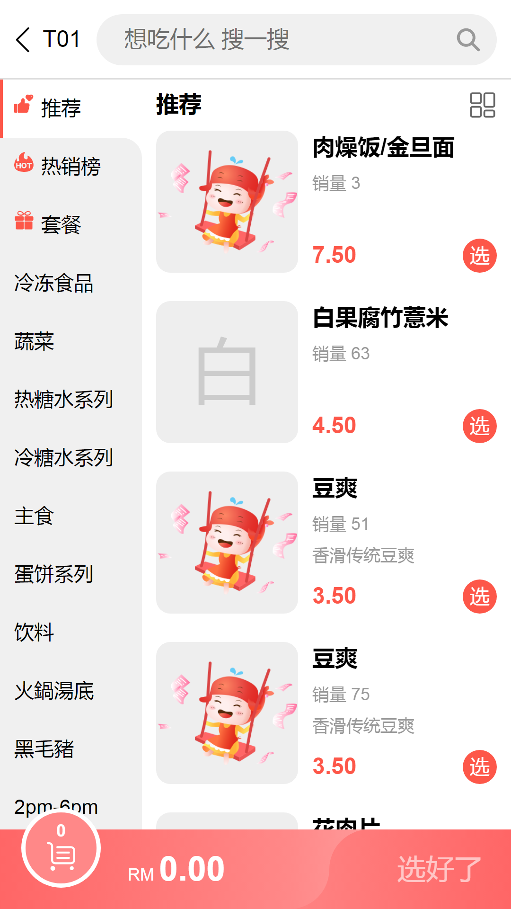
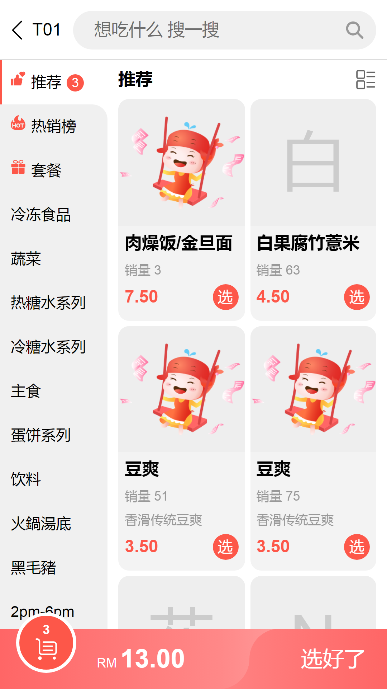
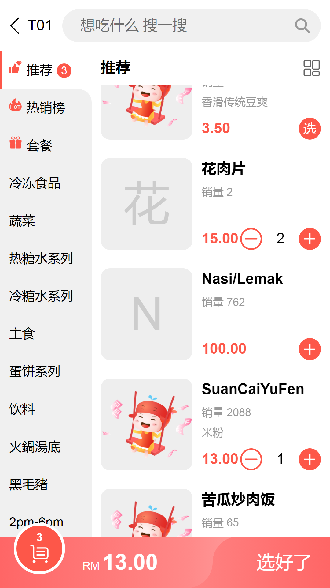
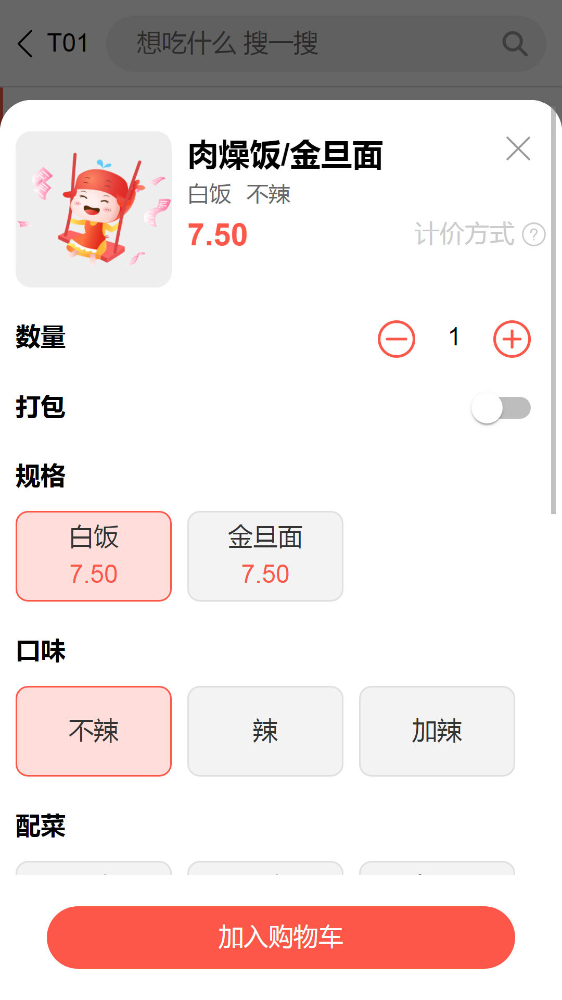
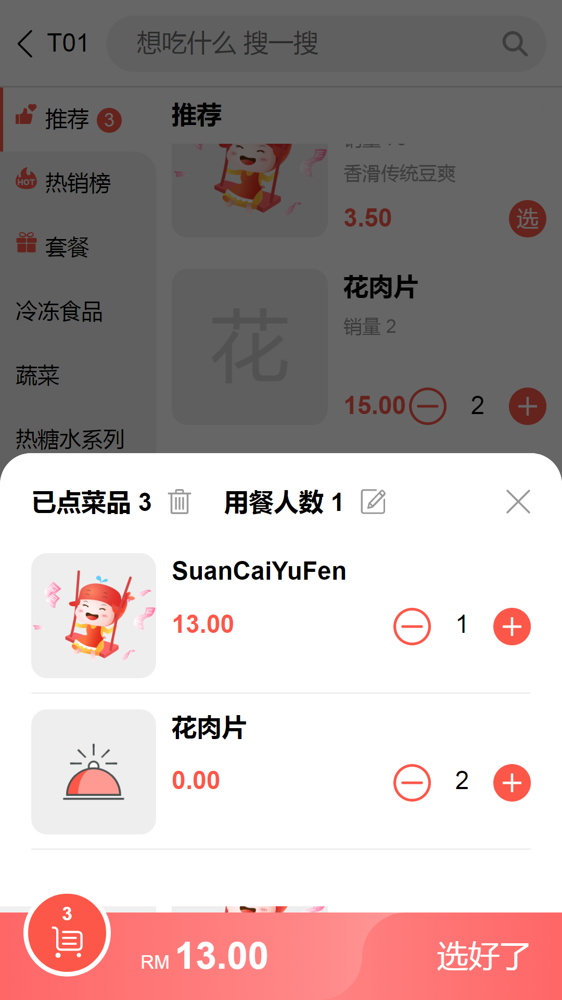
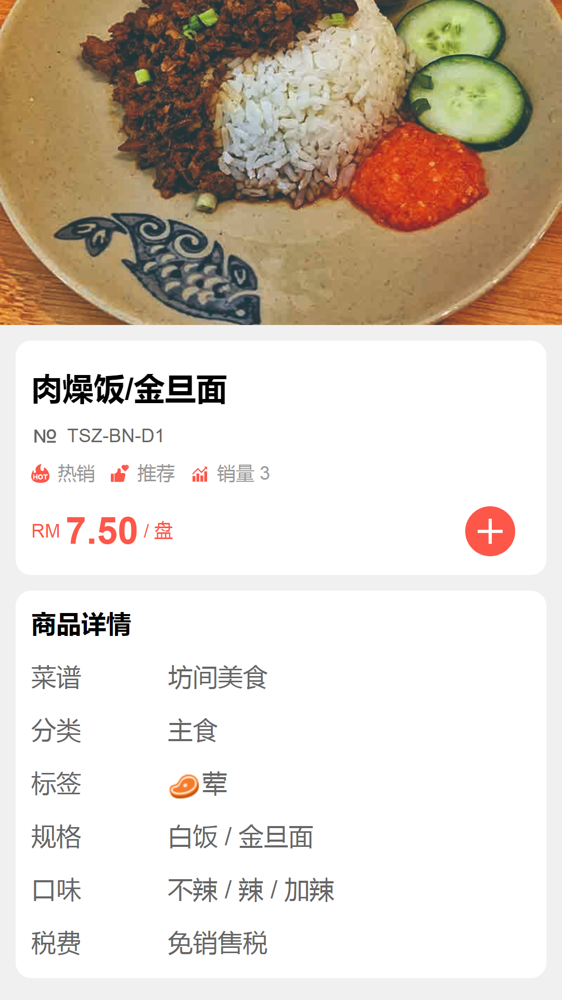

# yhofoodie-sweep-vue
NodeJS版本：14.17.6 或更高

运行命令：npm run dev

打包命令：npm run build

本演示版仅有前端代码，无后端代码。

[在线演示](https://plyh.xyz/sweep_demo/dist/index.html)

# 产品截图
<kbd>
    
    
    
    
    
    
</kbd>